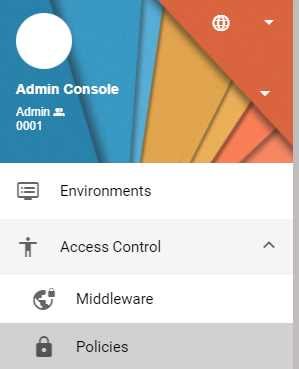
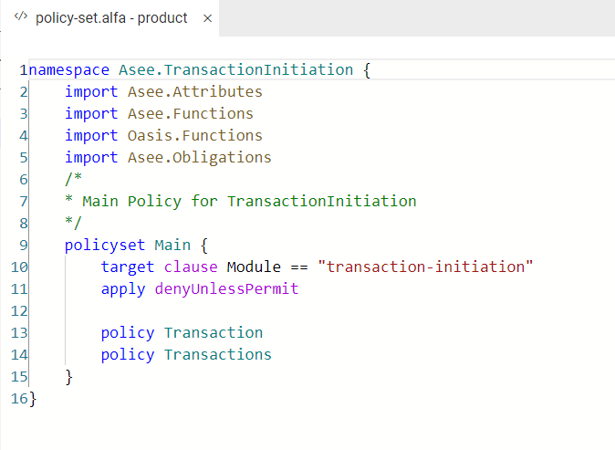

# Access controls - Middleware, Policies

Kreiranje polisa se radi u admin aplikaciji na putanji: Access Control - Policies

Prvi korak je dodavanje modula za koga želimo da napravimo polisu. Modul predstavlja naziv servisa koji želimo da štitimo (npr. "transaction-initiation" servis). Na komandu plus (+) možemo dodati novi modul ako već ne postoji.
image.png
--Alfa editor--
Kada dodamo novi modul Admin Tool aplikacija će za nas napraviti policy-set.alfa fajl koji predstavlja krovni fajl za tu polisu.

U apply sekciji obično stoji denyUnlessPermit ili permitUnlessDeny u zavisnosti od naših potreba. To označava akciju koja ce će dogoditi ako mi ručno ne odradimo neku zabranu ili pristup (deny/permit).
Krovni fajl močze da sadrči vise polisa (te polise moraju biti u okviru modula), tako da sa komandom policy definišemo koje polise uključujemo.

